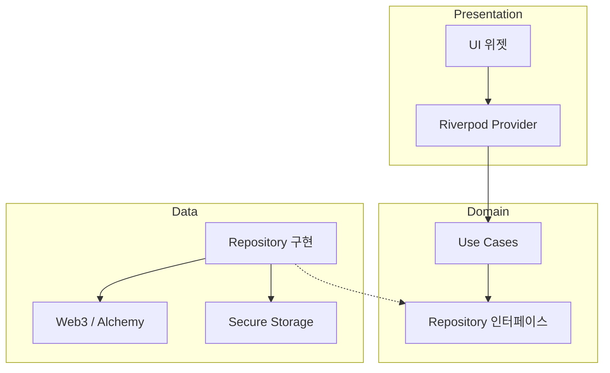

<div align="center">
  <h1>🔐 Crypto Wallet Pro</h1>
  <p><strong>Flutter로 개발된 차세대 암호화폐 지갑</strong></p>

  <a href="#"></a>
  <a href="#"></a>
  <a href="LICENSE"></a>
  <a href="#"></a>
  <a href="SECURITY.md"></a>

  <br><br>

  <strong><a href="README.md">English</a></strong> · <strong><a href="README.ko.md">한국어</a></strong>

  <br><br>

  
</div>

---

## 빠른 시작

```bash
git clone https://github.com/user/Crypto-Wallet-Pro.git
cd Crypto-Wallet-Pro
flutter pub get && flutter run
```

> **요구사항:** Flutter 3.10+, Dart 3.10+

---

## 주요 기능

- 🔐 **안전한 지갑** — BIP-39 니모닉, AES-256-GCM 암호화, 생체 인증
- 🌐 **멀티 네트워크** — 메인넷/테스트넷 전환, Web3 통합
- 🖼️ **NFT 갤러리** — ERC-721/1155 지원, 필터링 & Hero 애니메이션
- 🔗 **WalletConnect v2** — QR 스캔 dApp 연결 & 세션 관리
- 🎨 **글래스모피즘 UI** — 블러 효과가 적용된 모던 다크 테마

---

## 스크린샷

<details>
<summary>📸 모든 스크린샷 보기</summary>

### 메인 기능
| 대시보드 | NFT 갤러리 |
|:---:|:---:|
|  |  |

### 온보딩
| 보안 | dApps | NFT |
|:---:|:---:|:---:|
|  |  |  |

### 지갑 설정
| 생성 | 복구 문구 | 가져오기 |
|:---:|:---:|:---:|
|  |  |  |

</details>

---

## 기술 스택

| 분류 | 기술 |
|------|------|
| **프레임워크** | Flutter 3.x, Dart 3.10+ |
| **상태 관리** | Riverpod 2.0 |
| **라우팅** | GoRouter |
| **블록체인** | Web3Dart, WalletConnect v2 |
| **보안** | AES-256-GCM, PBKDF2, 생체 인증 |
| **저장소** | Flutter Secure Storage |

---

## 아키텍처

Clean Architecture와 기능 기반 모듈화를 적용합니다.

```
lib/
├── core/           # 공통 인프라
├── features/       # 기능 모듈
│   ├── data/       # 데이터 소스 & 레포지토리
│   ├── domain/     # 엔티티 & 유스케이스
│   └── presentation/  # UI & 상태 관리
└── shared/         # 기능 간 공유 코드
```



---

## 문서

| 가이드 | 설명 |
|-------|------|
| [사용자 가이드](docs/guides/USER_GUIDE.md) | 시작하기 및 사용법 |
| [보안](docs/security/) | 보안 아키텍처 & 가이드 |
| [아키텍처](docs/requirements/) | PRD 및 기술 스펙 |
| [전체 문서](docs/) | 전체 문서 인덱스 |

---

## 기여하기

기여는 언제나 환영합니다! [CONTRIBUTING.md](CONTRIBUTING.md)를 읽어주세요.

---

## 라이선스

MIT 라이선스. 자세한 내용은 [LICENSE](LICENSE)를 참조하세요.
