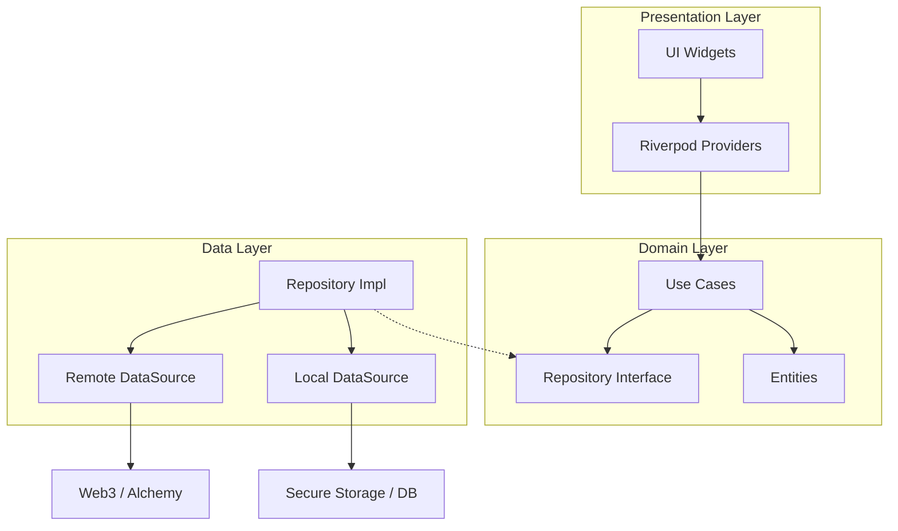

# Crypto Wallet Pro

**Crypto Wallet Pro**는 Flutter로 개발된 차세대 암호화폐 지갑 애플리케이션입니다. 강력한 보안, 현대적인 글래스모피즘(Glassmorphism) 디자인, 그리고 직관적인 사용자 경험을 제공합니다.

**Crypto Wallet Pro** is a next-generation cryptocurrency wallet application built with Flutter. It offers robust security, a modern Glassmorphism design, and an intuitive user experience.

---

## 📖 목차 (Table of Contents)
- [주요 기능 (Key Features)](#-주요-기능-key-features)
- [스크린샷 (Screenshots)](#-스크린샷-screenshots)
- [기술 스택 (Tech Stack)](#-기술-스택-tech-stack)
- [아키텍처 (Architecture)](#-아키텍처-architecture)
- [문서 (Documentation)](#-문서-documentation)
- [시작하기 (Getting Started)](#-시작하기-getting-started)
- [프로젝트 상태 (Project Status)](#-프로젝트-상태-project-status)
- [변경사항 요약 (Changelog Summary)](#-변경사항-요약-changelog-summary)
- [기여하기 (Contributing)](#-기여하기-contributing)
- [라이선스 (License)](#-라이선스-license)

---

## ✨ 주요 기능 (Key Features)

### 🔐 지갑 관리 (Wallet Management)
- **안전한 지갑 생성**: 니모닉(Mnemonic) 기반의 지갑 생성 및 3단계 검증 시스템
- **지갑 가져오기**: 12단어 복구 문구를 통한 지갑 복원 (붙여넣기 지원)
- **Defense-in-Depth 보안**:
  - 5계층 보안 아키텍처 (메모리 보안, UI 보안, 앱 보안, 접근 제어, 암호화 제어)
  - AES-256-GCM 이중 암호화 (앱 레벨 + 플랫폼 레벨)
  - PBKDF2-SHA256 키 파생 (100,000 iterations)
  - PIN 및 생체 인증(지문/Face ID) 통합
  - 플랫폼 보안 스토리지 (Android Keystore / iOS Keychain)

> **Secure Wallet Creation:** Mnemonic-based wallet creation and 3-step verification system.
> **Import Wallet:** Restore wallet via 12-word recovery phrase (supports paste).
> **Defense-in-Depth Security:** 5-layer security architecture, AES-256-GCM double encryption, PBKDF2-SHA256 key derivation, biometric integration, and platform secure storage.

### 💸 핵심 기능 (Core Features)
- **멀티 네트워크**: 메인넷(Mainnet) 및 테스트넷(Testnet) 간의 손쉬운 전환
- **트랜잭션**: 가스비(Gas) 자동 추정 및 실시간 ETH/ERC-20 토큰 전송
- **실시간 데이터**: Web3 클라이언트를 통한 실시간 잔액 및 데이터 조회
- **WalletConnect v2**: QR 코드 스캔을 통한 dApp 연결 및 세션 관리

> **Multi-Network:** Easy switching between Mainnet and Testnet.
> **Transactions:** Automatic gas estimation and real-time ETH/ERC-20 token transfers.
> **Real-time Data:** Real-time balance and data retrieval via Web3 clients.
> **WalletConnect v2:** dApp connection and session management via QR code scanning.

### 🎨 UI/UX 디자인 (UI/UX Design)
- **글래스모피즘**: 블러 효과와 네온 컬러를 활용한 세련된 다크 테마
- **NFT 갤러리**: ERC-721/1155 지원, 필터링 및 Hero 애니메이션
- **인터랙티브**: 부드러운 페이지 전환 및 스와이프 제스처(Pull-to-Refresh)

> **Glassmorphism:** Elegant dark theme utilizing blur effects and neon colors.
> **NFT Gallery:** ERC-721/1155 support with filtering and Hero animations.
> **Interactive:** Smooth page transitions and swipe gestures (Pull-to-Refresh).

---

## 📸 스크린샷 (Screenshots)

### 온보딩 (Onboarding)
| 보안 (Security) | dApps | NFT |
|:---:|:---:|:---:|
|  |  |  |

### 지갑 설정 (Wallet Setup)
| 지갑 생성 (Create Wallet) | 복구 구문 (Recovery Phrase) | 지갑 가져오기 (Import Wallet) |
|:---:|:---:|:---:|
|  |  |  |

### 메인 기능 (Main Features)
| 대시보드 (Dashboard) | NFT 갤러리 (NFT Gallery) |
|:---:|:---:|
|  |  |

---

## 🛠 기술 스택 (Tech Stack)

| 분류 (Category) | 기술 (Technology) |
|------|------|
| **프레임워크** | Flutter 3.x, Dart 3.10+ |
| **상태 관리** | Riverpod 2.0 (Annotations) |
| **라우팅** | GoRouter |
| **블록체인** | Web3Dart, WalletConnect Flutter v2 |
| **저장소** | Flutter Secure Storage |
| **보안** | Local Auth (Biometrics), PointyCastle (AES-256-GCM), BIP39/BIP32 |
| **암호화** | AES-256-GCM, PBKDF2-SHA256, FortunaRandom (CSPRNG) |
| **UI 도구** | Google Fonts (Inter), Shimmer, Mobile Scanner |

---

## 🏗 아키텍처 (Architecture)

이 프로젝트는 **Clean Architecture**와 **기능 기반 모듈화(Feature-based Modularization)** 원칙을 따릅니다.
This project follows **Clean Architecture** and **Feature-based Modularization** principles.

```
lib/
├── core/            # Common Infrastructure (Error, Network, Theme, etc.)
├── features/        # Feature Modules (Auth, Wallet, Send, NFT, etc.)
│   ├── data/        # Data Sources & Repository Implementations
│   ├── domain/      # Entities, Use Cases, Repository Interfaces
│   └── presentation/# UI Widgets & State Management (Providers)
└── shared/          # Global Shared Code (Services, Utilities)
```

### 레이어별 의존성 (Layer Dependencies)
- **Presentation** → **Domain** (Uses Entities, Calls Use Cases)
- **Data** → **Domain** (Implements Repository Interfaces)
- **Domain** → No External Dependencies (Pure Dart)

### 📐 다이어그램 (Mermaid)



---

## 💡 기술적 의사결정 (Tech Highlights)

이 프로젝트는 단순한 기능 구현을 넘어 **"유지보수성"**과 **"확장성"**을 고려하여 설계되었습니다.
This project is designed with **"Maintainability"** and **"Scalability"** in mind, going beyond simple feature implementation.

### 1. 왜 Riverpod인가? (Why Riverpod?)
- **Compile-safe**: 컴파일 타임에 Provider 에러를 잡을 수 있어 런타임 안정성이 보장됩니다. (Ensures runtime stability by catching Provider errors at compile time.)
- **Testability**: `Override` 기능을 통해 손쉽게 Mock 객체를 주입하여 테스트가 용이합니다. (Easy testing by injecting Mock objects via `Override`.)
- **No BuildContext**: BuildContext 없이도 상태에 접근 가능하여 비즈니스 로직 분리가 자연스럽습니다. (Access state without BuildContext, enabling natural separation of business logic.)

### 2. 왜 Clean Architecture인가? (Why Clean Architecture?)
- **프레임워크 독립성**: UI 프레임워크가 바뀌더라도 핵심 비즈니스 로직(Domain)은 그대로 유지됩니다. (Core business logic (Domain) remains intact even if the UI framework changes.)
- **테스트 용이성**: 모든 계층이 분리되어 있어 단위 테스트(Unit Test) 작성이 수월합니다. (Easier unit testing due to separation of layers.)
- **협업 효율성**: 역할과 책임이 명확하여 여러 개발자가 동시에 작업하기 좋습니다. (Clear roles and responsibilities facilitate collaboration.)

### 3. 보안 전략 (Security Strategy)
- **Private Key 보호**: `flutter_secure_storage`를 사용하여 OS 레벨의 Keystore/Keychain에 암호화하여 저장합니다. (Encrypted storage in OS-level Keystore/Keychain using `flutter_secure_storage`.)
- **메모리 보안**: 민감한 키 사용 후 즉시 메모리에서 소거하거나 필요한 순간에만 복호화하여 사용합니다. (Clearing sensitive keys from memory immediately after use or decrypting only when necessary.)

---

## 📚 문서 (Documentation)

- **Docs Index**: [docs/README.md](docs/README.md)
- **사용자 가이드 (User Guide)**: [docs/guides/USER_GUIDE.md](docs/guides/USER_GUIDE.md)
- **보안 가이드 (Security Guide)**: [docs/security/SCREENSHOT_PROTECTION_GUIDE.md](docs/security/SCREENSHOT_PROTECTION_GUIDE.md), [docs/security/SECURITY_DEVICE_INTEGRITY.md](docs/security/SECURITY_DEVICE_INTEGRITY.md)
- **개발 단계 (Development Phases)**: [docs/phases/PHASE_6_BIOMETRIC_INTEGRATION.md](docs/phases/PHASE_6_BIOMETRIC_INTEGRATION.md), [docs/phases/PHASE_7_AUDIT_LOGGING.md](docs/phases/PHASE_7_AUDIT_LOGGING.md), [docs/phases/PHASE_8_REMOTE_SYNC.md](docs/phases/PHASE_8_REMOTE_SYNC.md)
- **요구사항 (Requirements)**: [docs/requirements/](docs/requirements/) (PRD)
- **워크플로우 (Workflows)**: [docs/workflows/](docs/workflows/) (Implementation Workflows, Skeleton-First Approach)
- **디자인 개선 (Design Improvement)**: [docs/design/DESIGN_IMPROVEMENT_PLAN.md](docs/design/DESIGN_IMPROVEMENT_PLAN.md)

---

## 🚀 시작하기 (Getting Started)

### 사전 요구사항 (Prerequisites)
- **Flutter SDK**: 3.10.0+
- **Dart SDK**: 3.10.0+
- **Android Studio** or **VS Code**

### 설치 (Installation)

1. **저장소 복제 (Clone Repository)**
   ```bash
   git clone https://github.com/kaywalker91/Crypto-Wallet-Pro.git
   cd Crypto-Wallet-Pro
   ```

2. **의존성 설치 (Install Dependencies)**
   ```bash
   flutter pub get
   ```

3. **앱 실행 (Run App)**
   ```bash
   flutter run
   ```

### 빌드 (Build)
```bash
# Release APK (Android)
flutter build apk --release

# iOS Build
flutter build ios --release
```

---

## 📊 프로젝트 상태 (Project Status)

| 기능 (Feature) | 상태 (Status) | 설명 (Description) |
|------|------|------|
| 프로젝트 설정 (Project Setup) | ✅ Done | Basic Architecture & Theme Setup |
| 지갑 핵심 기능 (Wallet Core) | ✅ Done | Creation, Import, Mnemonic Management |
| Phase 5: 암호화 (Encryption) | ✅ Done | AES-256-GCM, PBKDF2, Double Encryption |
| Phase 6: 생체인증 (Biometrics) | ✅ Done | Biometric Key Protection, PIN Fallback |
| 대시보드 (Dashboard) | ✅ Done | Real-time Balance, Token List |
| NFT | ✅ Done | Gallery, Detail View, ERC-721/1155 Support |
| Web3 연동 (Web3 Integration) | ✅ Done | Send, Gas Estimation |
| WalletConnect | ✅ Done | v2 Integration, QR Scan |
| 수신 기능 (Receive) | ✅ Done | QR Code Generation & Share |
| 트랜잭션 내역 (History) | ✅ Done | Transaction History & Details |

---

## 🆕 변경사항 요약 (Changelog Summary)

- **2026-01-29**: Fixed bottom navigation overflow and responsive scaling.
- **2026-01-29**: Flutter analyze cleanup (withOpacity→withValues, MaterialState→WidgetState, Riverpod Ref migration, web3dart address usage, removed unnecessary logs/lints).
- **Security Enhancements**: Biometric key management, PIN fallback, session authentication, and secure storage key expansion.
- **Audit Logging/Sync**: Encrypted audit logs/stats, E2E remote security sync protocol.
- **Device Protection**: Screenshot/Recording protection & detection, Rooting/Jailbreak integrity checks with warning dialogs.
- **External Wallet**: MetaMask Deeplink/WalletConnect integration, connection screen & status UI.
- **Dev Support**: Extended Mockup Data/Tests, added security dependencies (pointycastle/app_links/url_launcher/uuid/mockito).
- **Documentation**: Phase 6~8, Screenshot Protection, Device Integrity, User Guide added.

---

## 🤝 기여하기 (Contributing)

기여는 언제나 환영합니다! 상세한 내용은 [CONTRIBUTING.md](CONTRIBUTING.md)를 확인해주세요.
Contributions are always welcome! Please check [CONTRIBUTING.md](CONTRIBUTING.md) for details.

1. **Fork** the project.
2. Create your Feature Branch. (`git checkout -b feature/amazing-feature`)
3. **Commit** your changes. (`git commit -m 'Add: amazing feature'`)
4. **Push** to the branch. (`git push origin feature/amazing-feature`)
5. Open a **Pull Request**.

---

## 📝 라이선스 (License)

이 프로젝트는 **MIT 라이선스** 하에 배포됩니다. 자세한 내용은 [LICENSE](LICENSE) 파일을 참조하세요.
This project is distributed under the **MIT License**. See [LICENSE](LICENSE) for more information.
