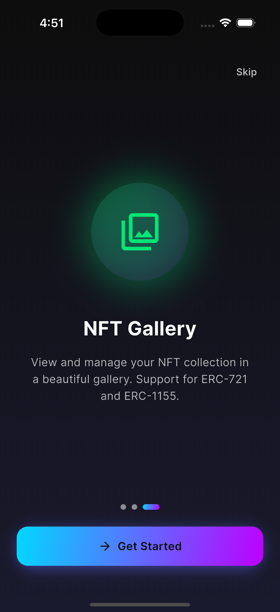
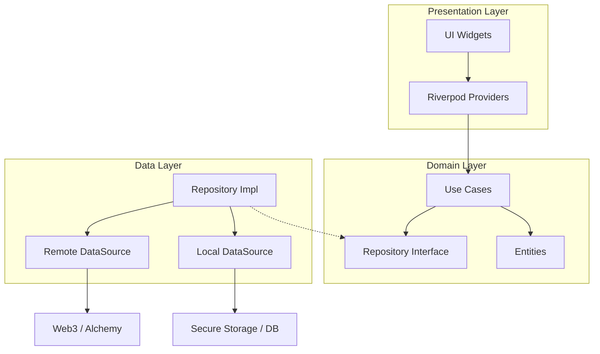

# Crypto Wallet Pro

**Crypto Wallet Pro**는 Flutter로 개발된 차세대 암호화폐 지갑 애플리케이션입니다. 강력한 보안, 현대적인 글래스모피즘(Glassmorphism) 디자인, 그리고 직관적인 사용자 경험을 제공합니다.

---

## 📖 목차
- [주요 기능](#-주요-기능)
- [스크린샷](#-스크린샷)
- [기술 스택](#-기술-스택)
- [아키텍처](#-아키텍처)
- [문서](#-문서)
- [시작하기](#-시작하기)
- [프로젝트 상태](#-프로젝트-상태)
- [변경사항 요약](#-변경사항-요약)
- [기여하기](#-기여하기)
- [라이선스](#-라이선스)

---

## ✨ 주요 기능

### 🔐 지갑 관리
- **안전한 지갑 생성**: 니모닉(Mnemonic) 기반의 지갑 생성 및 3단계 검증 시스템
- **지갑 가져오기**: 12단어 복구 문구를 통한 지갑 복원 (붙여넣기 지원)
- **Defense-in-Depth 보안**:
  - 5계층 보안 아키텍처 (메모리 보안, UI 보안, 앱 보안, 접근 제어, 암호화 제어)
  - AES-256-GCM 이중 암호화 (앱 레벨 + 플랫폼 레벨)
  - PBKDF2-SHA256 키 파생 (100,000 iterations)
  - PIN 및 생체 인증(지문/Face ID) 통합
  - 플랫폼 보안 스토리지 (Android Keystore / iOS Keychain)

### 💸 핵심 기능
- **멀티 네트워크**: 메인넷(Mainnet) 및 테스트넷(Testnet) 간의 손쉬운 전환
- **트랜잭션**: 가스비(Gas) 자동 추정 및 실시간 ETH/ERC-20 토큰 전송
- **실시간 데이터**: Web3 클라이언트를 통한 실시간 잔액 및 데이터 조회
- **WalletConnect v2**: QR 코드 스캔을 통한 dApp 연결 및 세션 관리

### 🎨 UI/UX 디자인
- **글래스모피즘**: 블러 효과와 네온 컬러를 활용한 세련된 다크 테마
- **NFT 갤러리**: ERC-721/1155 지원, 필터링 및 Hero 애니메이션
- **인터랙티브**: 부드러운 페이지 전환 및 스와이프 제스처(Pull-to-Refresh)

---

## 📸 스크린샷

### 온보딩 (Onboarding)
| 보안 | dApps | NFT |
|:---:|:---:|:---:|
|  |  |  |

### 지갑 설정 (Wallet Setup)
| 지갑 생성 | 복구 구문 | 지갑 가져오기 |
|:---:|:---:|:---:|
|  |  |  |

### 메인 기능 (Main Features)
| 대시보드 | NFT 갤러리 |
|:---:|:---:|
|  |  |

---

## 🛠 기술 스택

| 분류 | 기술 |
|------|------|
| **프레임워크** | Flutter 3.x, Dart 3.10+ |
| **상태 관리** | Riverpod 2.0 (Annotations) |
| **라우팅** | GoRouter |
| **블록체인** | Web3Dart, WalletConnect Flutter v2 |
| **저장소** | Flutter Secure Storage |
| **보안** | Local Auth (생체 인증), PointyCastle (AES-256-GCM), BIP39/BIP32 |
| **암호화** | AES-256-GCM, PBKDF2-SHA256, FortunaRandom (CSPRNG) |
| **UI 도구** | Google Fonts (Inter), Shimmer, Mobile Scanner |

---

## 🏗 아키텍처

이 프로젝트는 **Clean Architecture**와 **기능 기반 모듈화(Feature-based Modularization)** 원칙을 따릅니다.

```
lib/
├── core/            # 공통 인프라 (에러, 네트워크, 테마 등)
├── features/        # 기능별 모듈 (Auth, Wallet, Send, NFT 등)
│   ├── data/        # 데이터 소스 및 레포지토리 구현
│   ├── domain/      # 엔티티, 유스케이스, 레포지토리 인터페이스
│   └── presentation/# UI 위젯 및 상태 관리 (Providers)
└── shared/          # 전역 공유 코드 (서비스, 유틸리티)
```

### 레이어별 의존성
- **Presentation** → **Domain** 의존 (엔티티 사용, 유스케이스 호출)
- **Data** → **Domain** 구현 (레포지토리 인터페이스 구현)
- **Domain** → 외부 의존성 없음 (순수 Dart)

### 📐 다이어그램 (Mermaid)



---

## 💡 기술적 의사결정 (Tech Highlights)

이 프로젝트는 단순한 기능 구현을 넘어 **"유지보수성"**과 **"확장성"**을 고려하여 설계되었습니다.

### 1. 왜 Riverpod인가?
- **Compile-safe**: 컴파일 타임에 Provider 에러를 잡을 수 있어 런타임 안정성이 보장됩니다.
- **Testability**: `Override` 기능을 통해 손쉽게 Mock 객체를 주입하여 테스트가 용이합니다.
- **No BuildContext**: BuildContext 없이도 상태에 접근 가능하여 비즈니스 로직 분리가 자연스럽습니다.

### 2. 왜 Clean Architecture인가?
- **프레임워크 독립성**: UI 프레임워크가 바뀌더라도 핵심 비즈니스 로직(Domain)은 그대로 유지됩니다.
- **테스트 용이성**: 모든 계층이 분리되어 있어 단위 테스트(Unit Test) 작성이 수월합니다.
- **협업 효율성**: 역할과 책임이 명확하여 여러 개발자가 동시에 작업하기 좋습니다.

### 3. 보안 전략 (Security)
- **Private Key 보호**: `flutter_secure_storage`를 사용하여 OS 레벨의 Keystore/Keychain에 암호화하여 저장합니다.
- **메모리 보안**: 민감한 키 사용 후 즉시 메모리에서 소거하거나 필요한 순간에만 복호화하여 사용합니다.

---

## 📚 문서

- **Docs Index**: [docs/README.md](docs/README.md)
- **사용자 가이드**: [docs/guides/USER_GUIDE.md](docs/guides/USER_GUIDE.md)
- **보안 가이드**: [docs/security/SCREENSHOT_PROTECTION_GUIDE.md](docs/security/SCREENSHOT_PROTECTION_GUIDE.md), [docs/security/SECURITY_DEVICE_INTEGRITY.md](docs/security/SECURITY_DEVICE_INTEGRITY.md)
- **개발 단계(Phase)**: [docs/phases/PHASE_6_BIOMETRIC_INTEGRATION.md](docs/phases/PHASE_6_BIOMETRIC_INTEGRATION.md), [docs/phases/PHASE_7_AUDIT_LOGGING.md](docs/phases/PHASE_7_AUDIT_LOGGING.md), [docs/phases/PHASE_8_REMOTE_SYNC.md](docs/phases/PHASE_8_REMOTE_SYNC.md)
- **요구사항**: [docs/requirements/](docs/requirements/) (PRD)
- **워크플로우**: [docs/workflows/](docs/workflows/) (구현 워크플로우, Skeleton-First 방식)

---

## 🚀 시작하기

### 사전 요구사항
- **Flutter SDK**: 3.10.0 이상
- **Dart SDK**: 3.10.0 이상
- **Android Studio** 또는 **VS Code**

### 설치

1. **저장소 복제**
   ```bash
   git clone https://github.com/kaywalker91/Crypto-Wallet-Pro.git
   cd Crypto-Wallet-Pro
   ```

2. **의존성 설치**
   ```bash
   flutter pub get
   ```

3. **앱 실행**
   ```bash
   flutter run
   ```

### 빌드
```bash
# Release APK (Android)
flutter build apk --release

# iOS 빌드
flutter build ios --release
```

---

## 📊 프로젝트 상태

| 기능 | 상태 | 설명 |
|------|------|------|
| 프로젝트 설정 | ✅ 완료 | 기본 아키텍처 및 테마 설정 |
| 지갑 핵심 기능 | ✅ 완료 | 지갑 생성, 가져오기, 니모닉 관리 |
| Phase 5: 암호화 시스템 | ✅ 완료 | AES-256-GCM, PBKDF2, 이중 암호화 |
| Phase 6: 생체인증 통합 | ✅ 완료 | 생체인증 보호 키, PIN 폴백, 세션 관리 |
| 대시보드 | ✅ 완료 | 실시간 잔액, 토큰 리스트 |
| NFT | ✅ 완료 | 갤러리, 상세 보기, ERC-721/1155 지원 |
| Web3 연동 | ✅ 완료 | 송금(Send), 가스비 추정 |
| WalletConnect | ✅ 완료 | v2 연동, QR 스캔 |
| 수신 기능 | ✅ 완료 | QR 코드 생성 및 주소 공유 |
| 트랜잭션 내역 | ✅ 완료 | 거래 내역 조회 및 상세 정보 |

---

## 🆕 변경사항 요약

- **2026-01-29**: 하단 네비게이션 오버플로우 수정 및 반응형 스케일 다운 처리
- **2026-01-29**: Flutter analyze 정리 (withOpacity→withValues, MaterialState→WidgetState, Riverpod Ref 전환/의존성 추가, web3dart address 사용, 불필요 로그·lint 정리)
- **보안 강화**: 생체인증 키 관리, PIN 폴백, 세션 인증 및 저장소 키 확장
- **감사 로깅/동기화**: 암호화 감사 로그와 통계, E2E 원격 보안 동기화 프로토콜 추가
- **기기 보호**: 스크린샷/녹화 보호 및 감지, 루팅·탈옥 무결성 검사와 경고 다이얼로그 통합
- **외부 지갑 연결**: MetaMask 딥링크/WalletConnect 연동, 연결 화면 및 상태 UI 추가
- **개발 지원**: 목업 데이터 소스/테스트 확장, 보안 의존성(pointycastle/app_links/url_launcher/uuid/mockito) 추가
- **문서화**: Phase 6~8, 스크린샷 보호, 기기 무결성, 사용자 가이드 문서 추가

---

## 🤝 기여하기

기여는 언제나 환영합니다! 상세한 내용은 [CONTRIBUTING.md](CONTRIBUTING.md)를 확인해주세요.

1. 프로젝트를 **Fork** 합니다.
2. 기능 브랜치를 생성합니다. (`git checkout -b feature/amazing-feature`)
3. 변경 사항을 **커밋** 합니다. (`git commit -m 'Add: amazing feature'`)
4. 브랜치에 **Push** 합니다. (`git push origin feature/amazing-feature`)
5. **Pull Request**를 생성합니다.

---

## 📝 라이선스

이 프로젝트는 **MIT 라이선스** 하에 배포됩니다. 자세한 내용은 [LICENSE](LICENSE) 파일을 참조하세요.
