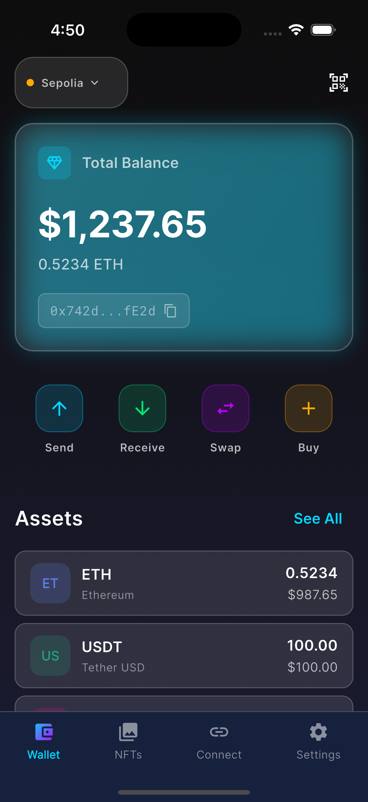
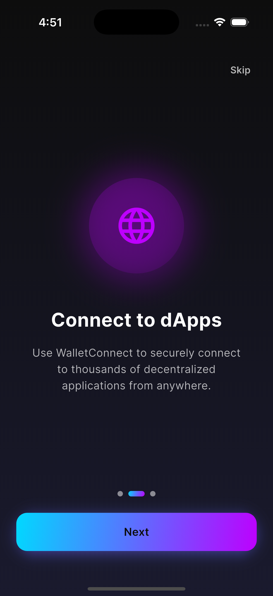

# Crypto Wallet Pro



**Crypto Wallet Pro**는 Flutter로 개발된 차세대 암호화폐 지갑 애플리케이션입니다. 강력한 보안, 현대적인 글래스모피즘(Glassmorphism) 디자인, 그리고 직관적인 사용자 경험을 제공합니다.  
*A modern, feature-rich cryptocurrency wallet application built with Flutter. It offers robust security, a sleek glassmorphism design, and an intuitive user experience.*

---

## 📖 Table of Contents / 목차
- [Features / 주요 기능](#-features--주요-기능)
- [Screenshots / 스크린샷](#-screenshots--스크린샷)
- [Tech Stack / 기술 스택](#-tech-stack--기술-스택)
- [Architecture / 아키텍처](#-architecture--아키텍처)
- [Getting Started / 시작하기](#-getting-started--시작하기)
- [Project Status / 프로젝트 상태](#-project-status--프로젝트-상태)
- [Contributing / 기여하기](#-contributing--기여하기)
- [License / 라이선스](#-license--라이선스)

---

## ✨ Features / 주요 기능

### 🔐 Wallet Management / 지갑 관리
- **Secure Creation**: 니모닉(Mnemonic) 기반의 지갑 생성 및 3단계 검증 시스템  
  *Secure wallet creation with mnemonic-based generation and 3-step verification.*
- **Import Wallet**: 12단어 복구 문구를 통한 지갑 가져오기 (붙여넣기 지원)  
  *Import wallet using 12-word recovery phrase with paste support.*
- **Security**: PIN 번호 및 생체 인증(지문/Face ID)을 통한 이중 보안 및 암호화된 저장소  
  *Double security with PIN and Biometric authentication (Fingerprint/Face ID), backed by encrypted storage.*

### 💸 Core Functionality / 핵심 기능
- **Multi-Network**: 메인넷(Mainnet) 및 테스트넷(Testnet) 간의 손쉬운 전환  
  *Easy switching between Mainnet and Testnet networks.*
- **Transactions**: 가스비(Gas) 자동 추정 및 실시간 ETH/ERC-20 토큰 전송  
  *Real-time ETH/ERC-20 transfers with automatic gas estimation.*
- **Real-Time Data**: Web3 클라이언트를 통한 실시간 잔액 및 데이터 조회  
  *Real-time balance and data fetching via Web3 client.*
- **WalletConnect v2**: QR 코드 스캔을 통한 dApp 연결 및 세션 관리  
  *dApp connectivity and session management via WalletConnect v2 with QR scanning.*

### 🎨 UI/UX Design / 디자인
- **Glassmorphism**: 블러 효과와 네온 컬러를 활용한 세련된 다크 테마  
  *Sleek dark theme utilizing blur effects and neon accents.*
- **NFT Gallery**: ERC-721/1155 지원, 필터링 및 Hero 애니메이션이 적용된 갤러리  
  *NFT Gallery supporting ERC-721/1155 with filtering and Hero animations.*
- **Interactivity**: 부드러운 페이지 전환 및 스와이프 제스처(Pull-to-Refresh)  
  *Smooth page transitions and intuitive swipe gestures.*

---

## 📸 Screenshots / 스크린샷

### Onboarding & Setup / 시작 및 설정
| Onboarding | Wallet Creation | Secure Storage |
|:---:|:---:|:---:|
|  |  |  |

### Core Experience / 메인 경험
| Dashboard | NFT Gallery | dApp Connect |
|:---:|:---:|:---:|
|  |  |  |

---

## 🛠 Tech Stack / 기술 스택

| Category | Technology |
|----------|------------|
| **Framework** | Flutter 3.x, Dart 3.10+ |
| **State Management** | Riverpod 2.0 (Annotations) |
| **Navigation** | GoRouter |
| **Blockchain** | Web3Dart, WalletConnect Flutter v2 |
| **Storage** | Flutter Secure Storage |
| **Security** | Local Auth (Biometrics), Encrypted Shared Preferences |
| **UI Tools** | Google Fonts (Inter), Shimmer, Mobile Scanner |

---

## 🏗 Architecture / 아키텍처

이 프로젝트는 **Clean Architecture**와 **기능 기반 모듈화(Feature-based Modularization)** 원칙을 따릅니다.
*This project follows Clean Architecture and Feature-based Modularization principles.*

```
lib/
├── core/            # 공통 인프라 (에러, 네트워크, 테마 등)
├── features/        # 기능별 모듈 (Auth, Wallet, Send, NFT 등)
│   ├── data/        # 데이터 소스 및 레포지토리 구현
│   ├── domain/      # 엔티티, 유스케이스, 레포지토리 인터페이스
│   └── presentation/# UI 위젯 및 상태 관리 (Providers)
└── shared/          # 전역 공유 코드 (서비스, 유틸리티)
```

---

## 🚀 Getting Started / 시작하기

### Prerequisites / 사전 요구사항
*   **Flutter SDK**: 3.10.0 이상
*   **Dart SDK**: 3.10.0 이상
*   **Android Studio** or **VS Code**

### Installation / 설치

1. **저장소 복제 (Clone Repository)**
   ```bash
   git clone https://github.com/kaywalker91/Crypto-Wallet-Pro.git
   cd Crypto-Wallet-Pro
   ```

2. **의존성 설치 (Install Dependencies)**
   ```bash
   flutter pub get
   ```

3. **앱 실행 (Run App)**
   ```bash
   flutter run
   ```

### Build / 빌드
```bash
# Release APK
flutter build apk --release

# iOS Bundle
flutter build ios --release
```

---

## 📊 Project Status / 프로젝트 상태

- [x] **Project Setup**: 기본 아키텍처 및 테마 설정 (Complete)
- [x] **Wallet Core**: 지갑 생성, 가져오기, 니모닉 관리 (Complete)
- [x] **Security**: PIN, 생체 인증, 보안 저장소 (Complete)
- [x] **Dashboard**: 실시간 잔액, 토큰 리스트 (Complete)
- [x] **NFT**: 갤러리, 상세 보기, ERC-721/1155 지원 (Complete)
- [x] **Web3 Integration**: 송금(Send), 가스비 추정 (Complete)
- [x] **WalletConnect**: v2 연동, QR 스캔 (Complete)
- [ ] **History**: 트랜잭션 내역 조회 (Planned)
- [ ] **Receive**: QR 코드를 통한 수신 기능 (Planned)

---

## 🤝 Contributing / 기여하기

기여는 언제나 환영합니다! 상세한 내용은 [CONTRIBUTING.md](CONTRIBUTING.md)를 확인해주세요.
*Contributions are welcome! Please check out [CONTRIBUTING.md](CONTRIBUTING.md) for details.*

1. **Fork** the project.
2. Create functionality branch (`git checkout -b feature/amazing-feature`).
3. **Commit** your changes (`git commit -m 'Add: amazing feature'`).
4. **Push** to the branch (`git push origin feature/amazing-feature`).
5. Open a **Pull Request**.

---

## 📝 License / 라이선스

This project is licensed under the **MIT License**. See the [LICENSE](LICENSE) file for details.  
*이 프로젝트는 MIT 라이선스 하에 배포됩니다. 자세한 내용은 LICENSE 파일을 참조하세요.*