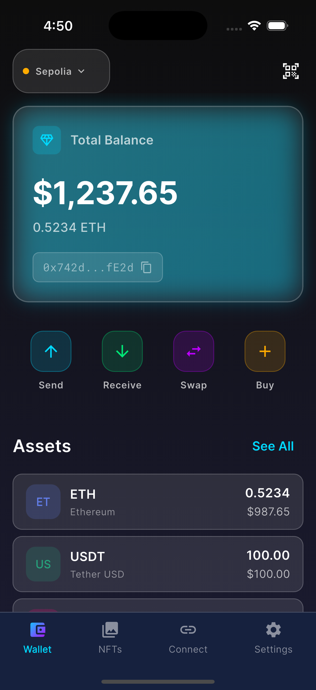
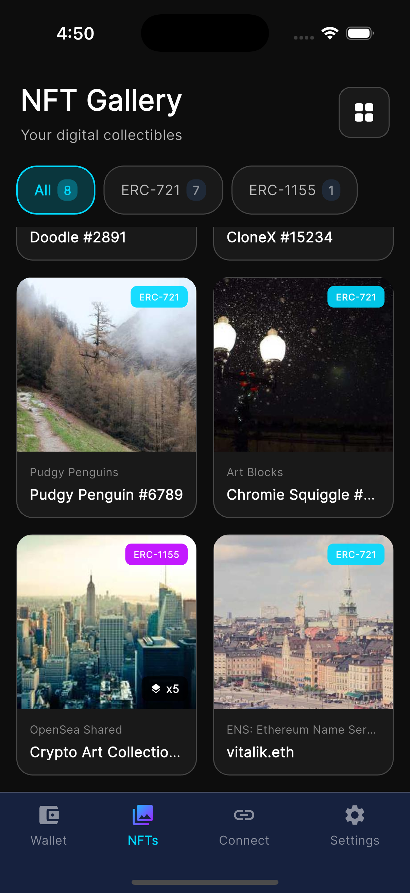
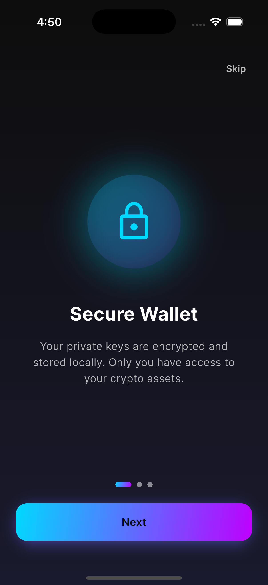
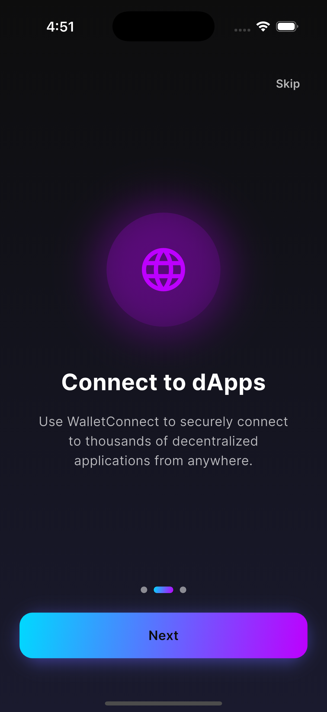
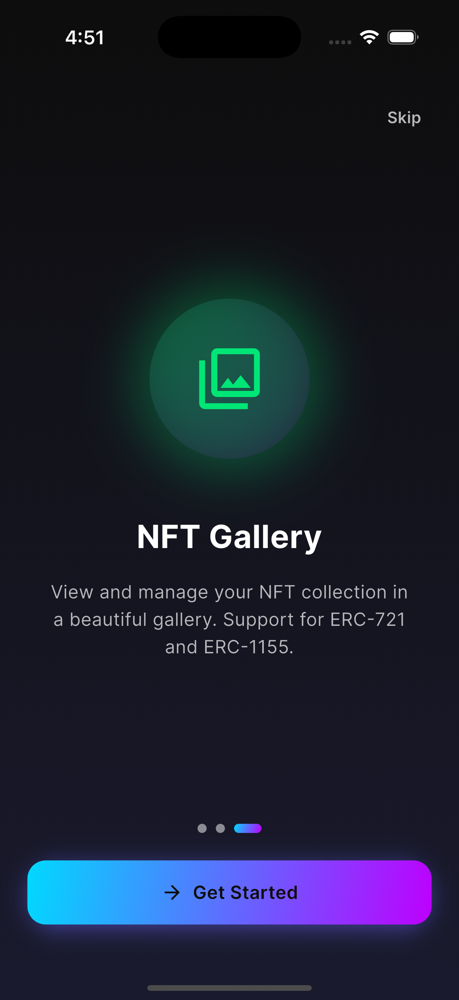
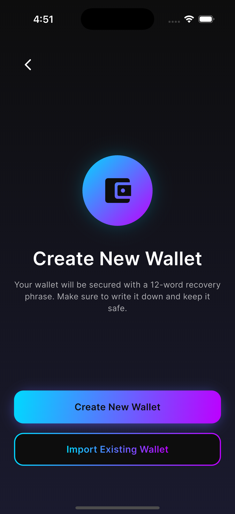
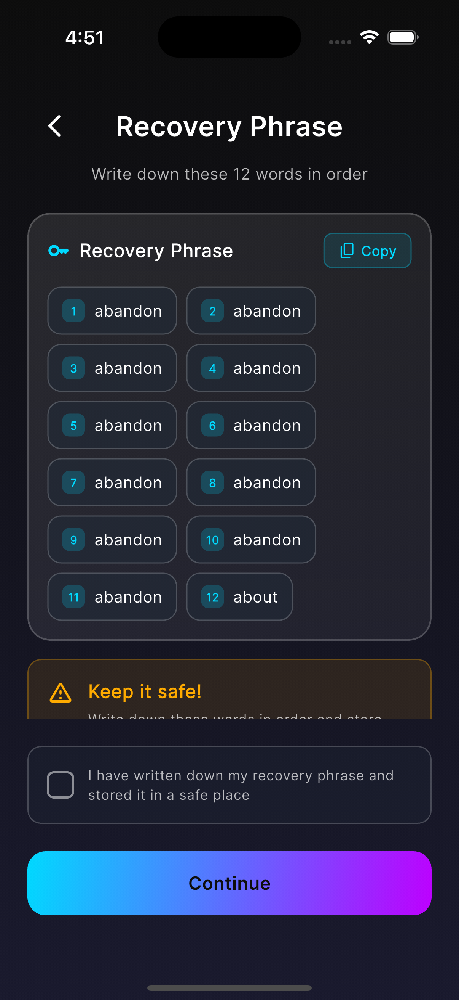
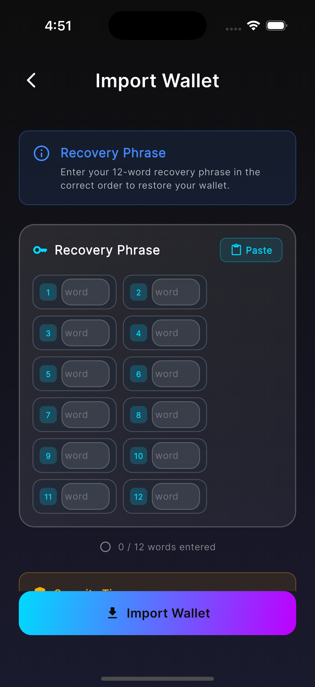
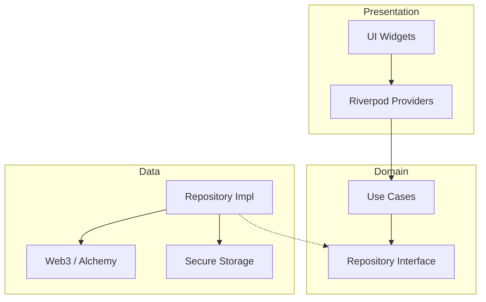

<div align="center">
  <h1>🔐 Crypto Wallet Pro</h1>
  <p><strong>Next-generation cryptocurrency wallet built with Flutter</strong></p>

  <a href="#"></a>
  <a href="#"></a>
  <a href="LICENSE"></a>
  <a href="#"></a>
  <a href="SECURITY.md"></a>

  <br><br>

  <strong><a href="README.md">English</a></strong> · <strong><a href="README.ko.md">한국어</a></strong>

  <br><br>

  
</div>

---

## Quick Start

```bash
git clone https://github.com/user/Crypto-Wallet-Pro.git
cd Crypto-Wallet-Pro
flutter pub get && flutter run
```

> **Requirements:** Flutter 3.10+, Dart 3.10+

---

## Features

- 🔐 **Secure Wallet** — BIP-39 mnemonic, AES-256-GCM encryption, biometric auth
- 🌐 **Multi-Network** — Mainnet/Testnet switching, Web3 integration
- 🖼️ **NFT Gallery** — ERC-721/1155 support with filtering & Hero animations
- 🔗 **WalletConnect v2** — QR scan dApp connection & session management
- 🎨 **Glassmorphism UI** — Modern dark theme with blur effects

---

## Screenshots

<details>
<summary>📸 View all screenshots</summary>

### Main Features
| Dashboard | NFT Gallery |
|:---:|:---:|
|  |  |

### Onboarding
| Security | dApps | NFT |
|:---:|:---:|:---:|
|  |  |  |

### Wallet Setup
| Create | Recovery | Import |
|:---:|:---:|:---:|
|  |  |  |

</details>

---

## Tech Stack

| Category | Technology |
|----------|------------|
| **Framework** | Flutter 3.x, Dart 3.10+ |
| **State** | Riverpod 2.0 |
| **Routing** | GoRouter |
| **Blockchain** | Web3Dart, WalletConnect v2 |
| **Security** | AES-256-GCM, PBKDF2, Biometrics |
| **Storage** | Flutter Secure Storage |

---

## Architecture

Clean Architecture with feature-based modularization.

```
lib/
├── core/           # Shared infrastructure
├── features/       # Feature modules
│   ├── data/       # Data sources & repositories
│   ├── domain/     # Entities & use cases
│   └── presentation/  # UI & state
└── shared/         # Cross-feature code
```


```mermaid
graph TD
    subgraph Presentation
        UI[UI Widgets] --> VM[Riverpod Providers]
    end
    subgraph Domain
        VM --> UC[Use Cases]
        UC --> Repo[Repository Interface]
    end
    subgraph Data
        RepoImpl[Repository Impl] -.-> Repo
        RepoImpl --> Remote[Web3 / Alchemy]
        RepoImpl --> Local[Secure Storage]
    end
```

---

## Documentation

| Guide | Description |
|-------|-------------|
| [User Guide](docs/guides/USER_GUIDE.md) | Getting started and usage |
| [Security](docs/security/) | Security architecture & guides |
| [Architecture](docs/requirements/) | PRD and technical specs |
| [All Docs](docs/) | Full documentation index |

---

## Contributing

Contributions are welcome! Please read [CONTRIBUTING.md](CONTRIBUTING.md) for guidelines.

---

## License

MIT License. See [LICENSE](LICENSE) for details.
