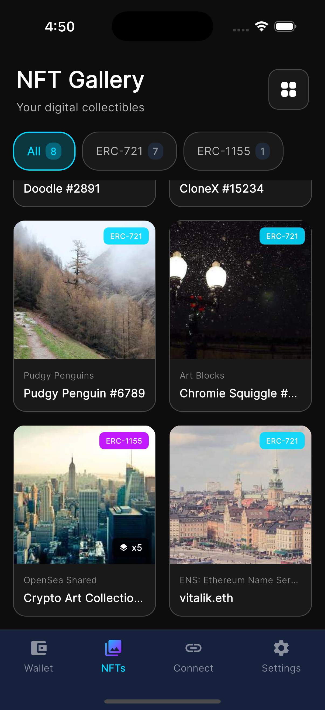
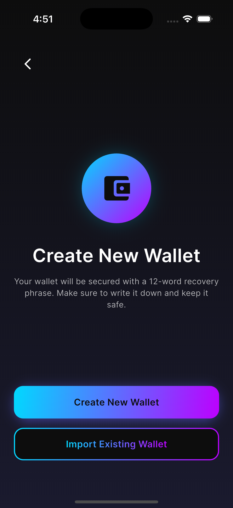

# Crypto Wallet Pro 사용자 가이드

이 문서는 Crypto Wallet Pro 앱의 기본 사용법을 안내합니다. (앱 버전 v1.0.0 기준)

> 참고: 본 앱은 학습/데모 용도로 제작되었습니다. 실제 자산 운용 시에는 보안 수칙을 반드시 확인하세요.

## 목차
1. 빠른 시작
2. 첫 실행: 온보딩
3. 지갑 생성
4. 지갑 가져오기
5. 보안 설정 (PIN/생체/자동 잠금)
6. 화면 구성 및 핵심 기능
7. 송금하기
8. 받기
9. 트랜잭션 내역
10. NFT 갤러리
11. WalletConnect 및 MetaMask 연결
12. 설정
13. 보안 팁
14. 문제 해결

## 빠른 시작
1. 앱 실행 → 온보딩 확인 → `Get Started`로 지갑 설정 이동.
2. `Create New Wallet` 또는 `Import Existing Wallet` 선택.
3. 복구 문구 백업 및 PIN/생체인증 설정 완료.
4. `Go to Wallet`로 대시보드 진입.

## 첫 실행: 온보딩
- 스와이프로 주요 기능 소개 슬라이드를 확인합니다.
- 상단 `Skip`을 누르면 바로 지갑 생성 화면으로 이동합니다.

## 지갑 생성
1. `Create New Wallet` 선택.
2. 12단어 복구 문구를 확인하고 오프라인으로 안전하게 보관합니다.
3. 복구 문구를 백업했음을 확인 체크 → `Continue`.
4. 임의로 선택된 3개의 단어를 맞춰 복구 문구를 검증합니다.
5. 완료 화면에서 지갑 주소 확인 → `Go to Wallet`.

> 주의: 복구 문구는 지갑 복구의 유일한 수단입니다. 캡처/공유 금지, 오프라인 보관을 권장합니다.

## 지갑 가져오기
1. `Import Existing Wallet` 선택.
2. 12단어 복구 문구를 순서대로 입력합니다. (붙여넣기 지원)
3. 입력 완료 후 `Import Wallet` 클릭.
4. `Wallet Imported!` 화면에서 주소 확인 → `Go to Wallet`.

## 보안 설정 (PIN/생체/자동 잠금)
- 설정 경로: `Settings` 탭 → `Security`.
- **Biometric Authentication**: Face ID/지문 인증 사용.
- **PIN Lock**: 4자리 이상 PIN 설정.
- **Auto-Lock**: 즉시/1분/5분/15분/해제 옵션 제공.
- 잠금 화면에서 생체인증 실패 시 PIN으로 해제할 수 있습니다.
- PIN 3회 실패 시 30초간 재시도 제한이 적용됩니다.

## 화면 구성 및 핵심 기능
### 탭 구성
- **Wallet**: 잔액, 토큰 목록, 송금/수신, 히스토리
- **NFTs**: NFT 갤러리 및 상세 보기
- **Connect**: WalletConnect 세션/QR 스캔, MetaMask 연결
- **Settings**: 네트워크/보안/환경설정

### 대시보드 (Wallet 탭)
- 상단 네트워크 버튼에서 `Ethereum Mainnet`/`Sepolia Testnet` 전환.
- 잔액 카드에서 지갑 주소 복사 가능.
- `Send`/`Receive` 버튼으로 송금/수신 이동.
- 우측 상단 `History` 아이콘으로 거래 내역 확인.
- 우측 상단 `QR` 아이콘으로 QR 스캔 실행.
- 아래로 당겨 새로고침(Pull-to-Refresh) 가능.

## 송금하기
1. `Send` 선택.
2. 자산(ETH 또는 토큰) 선택.
3. 받는 주소와 금액 입력.
4. `Estimate Gas`로 가스비 계산.
5. 속도(우선순위) 선택 후 `Send Now`.

> 팁: 주소는 `0x`로 시작하는 42자 형식입니다. 네트워크가 맞는지 확인하세요.

## 받기
1. `Receive` 선택.
2. QR 코드로 주소 공유 또는 주소 탭/복사.
3. `Share`로 주소 공유, `Copy`로 클립보드 복사.

## 트랜잭션 내역
- 대시보드 상단 `History` 아이콘에서 확인.
- 새로고침 버튼으로 최신 내역 갱신.
- 내역이 없으면 빈 상태 화면이 표시됩니다.

## NFT 갤러리
- `NFTs` 탭에서 보유 NFT 확인.
- 필터: `All`, `ERC-721`, `ERC-1155`.
- NFT를 탭하면 상세 화면으로 이동합니다.
- 아래로 당겨 새로고침 가능.

## WalletConnect 및 MetaMask 연결
### WalletConnect (dApp 연결)
1. `Connect` 탭에서 `Scan` 버튼으로 QR 스캔.
2. 세션 목록에서 연결 상태를 확인합니다.
3. 요청이 들어오면 승인/거절로 관리합니다.

### MetaMask 연결
- `Connect` 탭의 MetaMask 섹션에서 연결 버튼을 사용합니다.
- MetaMask 앱 설치가 필요하며, 기본적으로 Ethereum Mainnet에 연결됩니다.
- 연결 후 버튼에서 주소 확인 및 해제 가능.

> 참고: 서명/전송 요청은 UI 확인/승인 흐름을 제공하며, 일부 기능은 데모 범위로 제한될 수 있습니다.

## 설정
- **Network**: 블록체인 네트워크 선택.
- **Security**: 생체인증, PIN, 자동 잠금 설정.
- **Wallet**: 복구 문구 보기(현재 준비 중), 연결 앱 관리(준비 중), 지갑 삭제.
- **Preferences**: 표시 통화(USD/EUR/KRW/GBP/JPY), 알림 토글.
- **About**: 앱 정보, 약관/개인정보 처리방침(준비 중), 오픈 소스 라이선스.

> 주의: `Delete Wallet`는 이 기기에서 지갑 데이터를 삭제합니다. 복구 문구가 없으면 복원할 수 없습니다.

## 보안 팁
- 복구 문구는 종이에 적어 분산 보관하세요.
- 누구에게도 복구 문구/개인키를 공유하지 마세요.
- 공용 네트워크 사용 시 거래에 주의하세요.
- 생체인증과 PIN을 함께 설정하는 것을 권장합니다.

## 문제 해결
- **잔액/NFT가 보이지 않아요**: 네트워크가 맞는지 확인하고 새로고침하세요.
- **송금 오류**: 주소 형식(0x...), 네트워크, 잔액/가스비를 확인하세요.
- **QR 스캔이 안 돼요**: 카메라 권한을 허용했는지 확인하세요.
- **생체인증 실패**: 기기 생체인증 설정을 확인하고 PIN으로 해제하세요.

## 스크린샷
| 대시보드 | NFT 갤러리 | 지갑 설정 |
|:---:|:---:|:---:|
|  |  |  |
